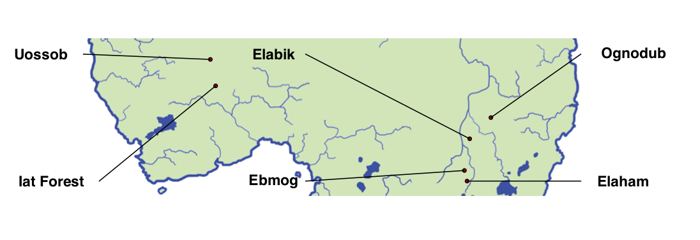
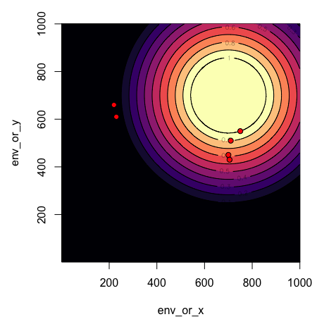

```{r setup, include=FALSE}
knitr::opts_chunk$set(echo = TRUE)
```

This document provides a general description of the "oranzees" model. The code to run and test the model can be found in the scripts [main.R](main.R) and [test.R](test.R). The consecutively numbered R markdown documents ([01-oranzees.Rmd](01-oranzees.Rmd) to [07-oranzees.Rmd](07-oranzees.Rmd)) document the full development of the model.

# The oranzees world
 
The oranzees model is an individual-based model, fully written in R, that reproduces a world where six populations of "oranzees" (an hypothetical ape species) live. The set-up is inspired by the research described in the paper *Cultures in Chimpanzees* [@whiten_cultures_1999]. The oranzees six populations are located in the continent "Pongogea", at positions analogous to the six populations of chimpanzees in @whiten_cultures_1999, see \autoref{fig1}.

The population sizes are also taken from the real chimpanzees populations considered in the study above. Following @lind_number_2010, we use data from @wrangham_why_2000:

Group     |  Population size  
--------- |----
Uossob    | 20
Elabik    | 42
Ognodub   | 49
Iat Forest| 76  
Ebmog     | 50
Elaham    | 95

In the oranzees world, 38 behaviours are possible (notice this is equivalent to the number of behaviour defined as *cultural* in @whiten_cultures_1999, whereas in the model 38 represent the *total* number of possible behaviours). Behaviours are divided in two categories, including 16 *social* and 22 *food-related* behaviours (more about this below).

The probability of expressing a behaviour depends, among other things, by its associated *ecological availability* and *genetic propensity*. 

  

## Ecological availability

Ecological availability has influence only on food-related behaviours. Ecological availability can be thought as a probability $p_e(0,1)$ that represents the likelihood of finding a resource, or its nutritional value, in each site. This probability is assigned randomly and independently to each behaviour. To assign it to the different populations we use a geographical gradient. For each behaviour, we choose a random point and calculate its distance to each population. Distances are then transformed to $p_e$ by rescaling them between 0 and 1, so that for the farther population $p_e=0$ i.e. the associated behaviour will be absent with an "ecological explanation" (according to the coding in @whiten_cultures_1999)  

In the example in \autoref{fig2} a particular behavior will have $p_e=1$ in the Ognodub site, $p_e=0$ in Iat Forest and Uossob, and intermediate values in the other sites.

{width=50%}

## Genetic propensity

In addition, each behaviour has an associated $p_g(0,1)$, that stands for the genetic propensity to express this behaviour. $p_g$ is assigned to *all* behaviours, both in the social and in the food-related category. Genetic propensity is calculated as ecological availability but with the difference that a parameter of the model, $\alpha_g$, determines the range of rescaling. With $\alpha_g=1$ the range is maximum and the effect is analogous to ecological availability. Intermediate values give less effect to genetic propensity, until $\alpha_g=0.5$ that produces all probabilities equal to $0.5$. Notice $\alpha_g=0.5$ does not imply that there is no genetic influence on oranzees behaviours, but that there are no differences between the populations with respect of the behaviours we consider.

# The life of oranzees

We assume that a time step $t$ of the simulation represents a month. Demography is very simple: from when they are 25 years old, there is a 1% probability an oranzee will die each month, or they die when they are 60 years old. The number of individuals in the population is fixed, so each time an oranzee dies is replaced by a newborn. At the beginning of the simulations, the populations are randomly initialised with individuals between 0 and 25 years old.

A newborn oranzee does not have any behaviour. Behaviours can be innovated at each time step/month. 
The process of innovation is influenced by: (i) the oranzees ‘state’, which depends from the behaviours an individual already possesses, (ii) the frequency of the behaviours already present in the population ("socially-mediated innovation"), and (iii) the ecological availability and genetic propensity associated to the behaviour.

## Oranzees state

#### Social behaviours

In the case of social behaviours, we assume four sub-categories of behaviours, each with four possible different behaviours, that serve the same goal, as illustrated here (notice the categories' names are purely indicative):

Sub-category  |    |    |    | 
--------------|----|----|----|----
play          | 1  | 2  | 3  | 4
display       | 5  | 6  | 7  | 8
groom         | 9  | 10 | 11 | 12
courtship     | 13 | 14 | 15 | 16

We assume that the state is based on how many of the four goals are fulfilled. A goal is considered fulfilled if an oranzee has at least one behaviour out of the four in the sub-category. An oranzee has a state value of $0.25$ if, for example, has at least one behaviour among behaviours 1 to 4, and none of the others, and a state value of $1$ if there is at least one behaviour in each sub-category. 

$p_\text{state}$, the probability to innovate a social behaviour, is drawn from a normal distribution with mean equal to $1-state$, and with a small standard deviation (this mean that even when all goals are fulfilled, that is the mean is zero, there is still some probability to innovate). 

#### Food-related behaviours

Food-related behaviours are also divided in sub-categories/goals, with the differences that there is a variable number of behaviours in each sub-category, and that sub-categories are associated to two different 'nutrients'. The idea is that individuals need to balance their nutritional intake, so that their optimal diet consist in a roughly equal number of foodstuff for one and the other nutrient.


Sub-category |    |    |    |    | Nutrient
-------------|----|----|----|----|---------
A            | 17 | 18 | 19 | 20 |    Y
B            | 21 | 22 | 23 | 24 |    Z
C            | 25 | 26 | 27 |    |    Y
D            | 28 | 29 | 30 |    |    Z
E            | 31 | 32 |    |    |    Y
F            | 33 | 34 |    |    |    Z
G            | 35 |    |    |    |    Y
H            | 36 |    |    |    |    Z
I            | 37 |    |    |    |    Y
J            | 38 |    |    |    |    Z 

The state, for food-related behaviours, depends on the total amount of food *and* on the balance between nutrients, and it is calculated as the sum of each sub-category fulfilled (as above, for this there needs to be at least one behaviour) minus the difference between the number of sub-categories providing nutrient Y and the number of sub-categories providing nutrient Z. As above, all is normalised between $0$ and $1$, and $p_\text{state}$ is then calculated. 

## Innovation

While the probability of innovation depends on $p_\text{state}$ as described above, what behaviour an oranzee will innovate depends both on the frequency of the behaviours already present in the population, and on the ecological availability and genetic propensity associated to the behaviour. Each behaviour has a probability to be innovated drawn from a normal distribution with mean equals to its total instances in the population. (The normal distribution is useful because allows for absent behaviours to be anyway possible to be innovated, with low probability). Only one behaviour per category can be innovated at each time step.  

After that, the behaviour chosen in the previous step is actually innovated with probability depending on its genetic propensity (or on a combination of its genetic propensity and ecological availability in case of food-related behaviours).

## Optimsation

Notice that, through the above process, oranzee can innovate behaviours that they already posses, so that innovation does not produce any modification. Also, they can innovate behaviours that are not useful for them, for example by acquiring a second behaviour in a sub-category for which they have already fulfilled the goal. 

A parameter of the model, $opt$, determines the probability that each individual will "optimise" its repertoire or not, at each time step. The idea is that, at each time step, oranzees may choose which behaviours to perform, among the ones they have in their repertoire. Behaviours that are not performed are excluded from their repertoire (but they can be re-innovated and included again). To decide which behaviour to perform (and, consequently, which to discard), oranzees optimise their internal state, as done to determine whether they innovate or not. If more than one behaviour is fulfilling a specific goal, one behaviour in the ‘goal-group’, chosen at random, can be discarded. 

# Output of the model

The main output we are interested is the number of behaviour that would be considered "cultural" in the populations of oranzees according to the coding of @whiten_cultures_1999. We run simulation for $t_\text{max}=12000$ (corresponding to 100 years of oranzee-time). We then classify each behaviour, in each population as:

* *customary* is a behaviour observed in over 50% of individuals in at least one age class.

* *habitual* is a behaviour observed in at least two individuals over all the population.

* *present* is a behaviour observed in at least one individual over all the population.

* *absent* is a behaviour never observed.

* *ecological explanations* is a behaviour that is absent because of local ecological features (i.e. associated to $p_e=0$).

(Notice the last category in @whiten_cultures_1999 (*unknown*, i.e. "the behaviour has not been recorded, but this may be due to inadequacy of relevant observational opportunities") does not apply in our case.)

Age classes to calculate customary behaviours are defined as follows:

* *adults*: individuals that are more that 16-year old.

* *subadults*: individuals between 8 and 16-year old.

* *juveniles*: individuals that are less than 8-year old.

Finally, we use the coding to calculate the "patterns" described in @whiten_cultures_1999:

* *A*: patterns observed in no site.

* *B*: patterns not achieving habitual frequencies at any site.

* *C*: patterns for which any absence can be explained by local ecological factors.

* *D*: patterns customary or habitual at some sites yet absent at others, with no ecological explanation, i.e. the "cultural" behaviours.


## References
